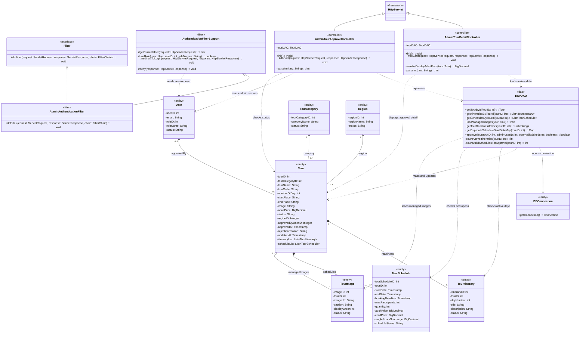

# Approve Tour Class Diagram

## Scope

Diagram này mô tả luồng duyệt Tour hiện tại phía Admin. Source có màn chi tiết để Admin xem dữ liệu trước khi duyệt (`AdminTourDetailController`) và request duyệt chính thức qua `AdminTourApproveController`.

Điều kiện được xác nhận từ source:

- Tour phải đang có `status = "Pending"` trước khi duyệt.
- `TourDAO.getTourReadinessErrors(tourID)` kiểm tra dữ liệu sẵn sàng, gồm thông tin Tour, ảnh, itinerary, lịch hợp lệ và ngày khởi hành trùng.
- `TourDAO.approveTour(tourID, adminUserID, openValidSchedules)` update Tour thành `Active`, set `approvedByUserID`, `approvedAt`, clear `rejectionReason`, update `updatedAt`.
- Mở lịch là tùy chọn theo tham số `openSchedules`; chỉ các lịch `Planned`, còn hiệu lực và còn chỗ mới được đổi sang `Open`.
- Reject Tour là endpoint/use case riêng (`AdminTourRejectController`, `TourDAO.rejectTour`) nên không đưa vào diagram này.
- Booking/BookingDetail không được đưa vào vì source duyệt Tour hiện tại không gọi trực tiếp các class đó.

## Confirmed Classes

| Class | Package | Stereotype | Use Case | Evidence |
|---|---|---|---|---|
| `AdminAuthenticationFilter` | `vn.edu.fpt.filter` | `<<filter>>` | Approve Tour | `@WebFilter` bảo vệ `/admin/*`, `extends AuthenticationFilterSupport`, `implements Filter`. |
| `AuthenticationFilterSupport` | `vn.edu.fpt.filter` | `<<filter>>` | Approve Tour | Cung cấp `getCurrentUser`, `hasRole`, `redirectToLogin`, `deny` cho Admin filter. |
| `AdminTourDetailController` | `vn.edu.fpt.controller.admin` | `<<controller>>` | Approve Tour | Load Tour, itineraries, schedules, images và readiness trước khi Admin duyệt. |
| `AdminTourApproveController` | `vn.edu.fpt.controller.admin` | `<<controller>>` | Approve Tour | `@WebServlet("/admin/tour/approve")`, kiểm tra status/readiness và gọi `approveTour`. |
| `TourDAO` | `vn.edu.fpt.DAO` | `<<dao>>` | Approve Tour | Load Tour, kiểm tra readiness, itinerary, schedule, duplicate date, approve transaction. |
| `DBConnection` | `vn.edu.fpt.common` | `<<utility>>` | Approve Tour | DAO mở connection để query/update. |
| `User` | `vn.edu.fpt.model` | `<<entity>>` | Approve Tour | Admin lấy từ session và dùng `userID` làm `approvedByUserID`. |
| `Tour` | `vn.edu.fpt.model` | `<<entity>>` | Approve Tour | Entity được kiểm tra trạng thái và update metadata duyệt. |
| `TourSchedule` | `vn.edu.fpt.model` | `<<entity>>` | Approve Tour | Readiness kiểm tra lịch hợp lệ; approval có thể mở lịch `Planned`. |
| `TourItinerary` | `vn.edu.fpt.model` | `<<entity>>` | Approve Tour | Readiness kiểm tra số ngày itinerary active. |
| `TourImage` | `vn.edu.fpt.model` | `<<entity>>` | Approve Tour | Detail controller load managed images để Admin xem. |
| `TourCategory` | `vn.edu.fpt.model` | `<<entity>>` | Approve Tour | Quan hệ domain của `Tour`. |
| `Region` | `vn.edu.fpt.model` | `<<entity>>` | Approve Tour | Quan hệ domain của `Tour`. |

## Class Diagram

