# Create Tour Class Diagram

## Scope

Diagram này mô tả luồng tạo Tour hiện tại trong source code, gồm hai request riêng:

- Tạo thông tin Tour cơ bản qua `AddTourController`.
- Tạo lịch khởi hành đầu tiên hoặc lịch tiếp theo qua `AddTourScheduleController`.

Sau khi lưu Tour, source redirect sang form thêm lịch. Tour được tạo với `status = "Draft"`. Việc gửi duyệt không được tự động gọi trong `AddTourController` hoặc `AddTourScheduleController`; source có `SubmitTourForApprovalController` riêng nên action gửi duyệt được ghi nhận trong phân tích nhưng không đưa vào main Create Tour diagram.

## Confirmed Classes

| Class | Package | Stereotype | Use Case | Evidence |
|---|---|---|---|---|
| `StaffAuthenticationFilter` | `vn.edu.fpt.filter` | `<<filter>>` | Create Tour | `@WebFilter` bảo vệ `/staff/*`, `extends AuthenticationFilterSupport`, `implements Filter`. |
| `AuthenticationFilterSupport` | `vn.edu.fpt.filter` | `<<filter>>` | Create Tour | Cung cấp `getCurrentUser`, `hasRole`, `redirectToLogin`, `deny` cho Staff filter. |
| `AddTourController` | `vn.edu.fpt.controller.staff` | `<<controller>>` | Create Tour | `@WebServlet("/staff/tour/add")`, đọc form, validate, gọi `tourDAO.insertTourWithItineraries`. |
| `StaffTourFormSupport` | `vn.edu.fpt.controller.staff` | `<<support>>` | Create Tour | Parent của `AddTourController`, chứa `TourDAO`, `AdministrativeUnitDAO`, đọc/validate/build `Tour`. |
| `TourFormData` | `vn.edu.fpt.controller.staff.StaffTourFormSupport` | `<<form_data>>` | Create Tour | Nested form data class được `readTourFormData` trả về. |
| `AddTourScheduleController` | `vn.edu.fpt.controller.staff` | `<<controller>>` | Create Tour | `@WebServlet("/staff/tour/schedule/add")`, load Tour vừa tạo, validate và insert `TourSchedule`. |
| `StaffTourScheduleSupport` | `vn.edu.fpt.controller.staff` | `<<support>>` | Create Tour | Parent của `AddTourScheduleController`, đọc/validate/build schedule, kiểm tra trùng ngày và khoảng cách ngày. |
| `ScheduleFormData` | `vn.edu.fpt.controller.staff.StaffTourScheduleSupport` | `<<form_data>>` | Create Tour | Nested form data class được `readScheduleFormData` trả về. |
| `TourDAO` | `vn.edu.fpt.DAO` | `<<dao>>` | Create Tour | Insert Tour, itinerary, image, schedule; generate tour code; query schedule existing. |
| `AdministrativeUnitDAO` | `vn.edu.fpt.DAO` | `<<dao>>` | Create Tour | Validate tỉnh khởi hành/kết thúc bằng `isValidProvinceName`. |
| `TourImageStorage` | `vn.edu.fpt.common` | `<<utility>>` | Create Tour | `StaffTourFormSupport` dùng để validate content type và lưu ảnh upload. |
| `DBConnection` | `vn.edu.fpt.common` | `<<utility>>` | Create Tour | DAO mở connection qua `new DBConnection().getConnection()`. |
| `Tour` | `vn.edu.fpt.model` | `<<entity>>` | Create Tour | Entity được build từ form và persist qua `TourDAO`. |
| `TourSchedule` | `vn.edu.fpt.model` | `<<entity>>` | Create Tour | Entity lịch được build và insert sau khi Tour đã có `tourID`. |
| `TourItinerary` | `vn.edu.fpt.model` | `<<entity>>` | Create Tour | `Tour.itineraryList`, được insert trong transaction tạo Tour. |
| `TourImage` | `vn.edu.fpt.model` | `<<entity>>` | Create Tour | DAO persist ảnh quản lý tour vào `Tour_Image`. |
| `TourCategory` | `vn.edu.fpt.model` | `<<entity>>` | Create Tour | `TourDAO.existsActiveCategory` validate danh mục. |
| `Region` | `vn.edu.fpt.model` | `<<entity>>` | Create Tour | `TourDAO.existsActiveRegion` validate khu vực. |
| `AdministrativeUnit` | `vn.edu.fpt.model` | `<<entity>>` | Create Tour | `AdministrativeUnitDAO` trả về danh sách tỉnh active. |
| `User` | `vn.edu.fpt.model` | `<<entity>>` | Create Tour | Lấy từ session để set `createdByUserID`; Staff filter cũng đọc User. |

## Class Diagram

```mermaid
classDiagram
direction TB

class HttpServlet {
  <<framework>>
}

class Filter {
  <<interface>>
  +doFilter(request: ServletRequest, response: ServletResponse, chain: FilterChain): void
}

class AuthenticationFilterSupport {
  <<filter>>
  #getCurrentUser(request: HttpServletRequest): User
  #hasRole(user: User, roleID: int, roleNames: String): boolean
  #redirectToLogin(request: HttpServletRequest, response: HttpServletResponse): void
  #deny(response: HttpServletResponse): void
}

class StaffAuthenticationFilter {
  <<filter>>
  +doFilter(request: ServletRequest, response: ServletResponse, chain: FilterChain): void
}

class AddTourController {
  <<controller>>
  #doGet(request: HttpServletRequest, response: HttpServletResponse): void
  #doPost(request: HttpServletRequest, response: HttpServletResponse): void
  -fillSubmittedOrBlankItineraries(itineraries: List~TourItinerary~, dayCount: int): List~TourItinerary~
}

class StaffTourFormSupport {
  <<support>>
  #tourDAO: TourDAO
  #administrativeUnitDAO: AdministrativeUnitDAO
  #forwardTourForm(request, response, tour, itineraries, dayCount, mode, formAction, pageTitle, submitLabel, errors): void
  #readTourFormData(request: HttpServletRequest): TourFormData
  #validateTourData(data: TourFormData, editMode: boolean): List~String~
  #buildTourFromData(data: TourFormData, currentUserID: Integer, includeInitialSchedule: boolean): Tour
  #buildDefaultTour(dayCount: int): Tour
  #resolveDayCount(request: HttpServletRequest, tour: Tour): int
  #getCurrentUserID(request: HttpServletRequest): Integer
}

class TourFormData {
  <<form_data>>
  ~tourCategoryIDRaw: String
  ~tourName: String
  ~tourType: String
  ~numberOfDayRaw: String
  ~numberOfNightsRaw: String
  ~startPlace: String
  ~endPlace: String
  ~image: String
  ~introImage: String
  ~status: String
  ~regionIDRaw: String
  ~itineraries: List~TourItinerary~
}

class AddTourScheduleController {
  <<controller>>
  #doGet(request: HttpServletRequest, response: HttpServletResponse): void
  #doPost(request: HttpServletRequest, response: HttpServletResponse): void
  -buildDefaultSchedule(tour: Tour): TourSchedule
  -resolveNextStartDate(tour: Tour): LocalDate
}

class StaffTourScheduleSupport {
  <<support>>
  #tourDAO: TourDAO
  #forwardScheduleForm(request, response, tour, schedule, mode, formAction, pageTitle, submitLabel, errors): void
  #readScheduleFormData(request: HttpServletRequest): ScheduleFormData
  #validateScheduleData(data: ScheduleFormData, tour: Tour, existingSchedule: TourSchedule, editMode: boolean, lockedCore: boolean): List~String~
  #buildScheduleFromData(data: ScheduleFormData, tour: Tour, existingSchedule: TourSchedule, lockedCore: boolean): TourSchedule
  #getTourForSchedule(tourID: int): Tour
  #canManageScheduleForTour(tour: Tour): boolean
  #resolveSystemScheduleStatus(tour: Tour, existingSchedule: TourSchedule): String
  #resolveScheduleTransportType(tour: Tour, scheduleTransportType: String): String
}

class ScheduleFormData {
  <<form_data>>
  ~tourIDRaw: String
  ~tourScheduleIDRaw: String
  ~scheduleTransportType: String
  ~startDateRaw: String
  ~endDateRaw: String
  ~bookingDeadlineRaw: String
  ~maxParticipantsRaw: String
  ~adultPriceRaw: String
  ~childPriceRaw: String
  ~infantPriceRaw: String
  ~singleRoomSurchargeRaw: String
  ~scheduleStatus: String
}

class TourDAO {
  <<dao>>
  +existsActiveCategory(categoryID: int): boolean
  +existsActiveRegion(regionID: int): boolean
  +getNextTourCodePreview(): String
  +insertTourWithItineraries(tour: Tour): int
  +getTourById(tourID: int): Tour
  +getSchedulesByTourId(tourID: int): List~TourSchedule~
  +syncOpenSchedulesWithTourStatus(tour: Tour): boolean
  +insertTourSchedule(schedule: TourSchedule): boolean
  +isDuplicateScheduleStartDate(tourID: int, currentScheduleID: int, startDate: Timestamp): boolean
  +isScheduleStartDateTooClose(tourID: int, currentScheduleID: int, startDate: Timestamp, minGapDays: int): boolean
  -insertItineraries(conn: Connection, tourID: int, itineraries: List~TourItinerary~): void
  -insertSchedules(conn: Connection, tourID: int, schedules: List~TourSchedule~): void
  -replaceManagedImages(conn: Connection, tourID: int, tour: Tour): void
  -updateTourCode(conn: Connection, tourID: int): void
  -buildTourCode(tourID: int): String
}

class AdministrativeUnitDAO {
  <<dao>>
  +getActiveProvinces(): List~AdministrativeUnit~
  +isValidProvinceName(provinceName: String): boolean
}

class TourImageStorage {
  <<utility>>
  +isAllowedContentType(contentType: String): boolean
  +save(part: Part, fileName: String): String
  +resolve(requestedName: String): Path
}

class DBConnection {
  <<utility>>
  +getConnection(): Connection
}

class User {
  <<entity>>
  -userID: int
  -email: String
  -roleID: int
  -roleName: String
  -status: String
}

class Tour {
  <<entity>>
  -tourID: int
  -tourCategoryID: int
  -tourName: String
  -tourCode: String
  -tourType: String
  -numberOfDay: int
  -numberOfNights: Integer
  -startPlace: String
  -endPlace: String
  -image: String
  -introImage: String
  -adultPrice: BigDecimal
  -childrenPrice: BigDecimal
  -singleRoomSurcharge: BigDecimal
  -status: String
  -featured: boolean
  -regionID: Integer
  -createdByUserID: Integer
  -itineraryList: List~TourItinerary~
  -scheduleList: List~TourSchedule~
}

class TourSchedule {
  <<entity>>
  -tourScheduleID: int
  -tourID: int
  -scheduleTransportType: String
  -startDate: Timestamp
  -endDate: Timestamp
  -bookingDeadline: Timestamp
  -minParticipants: int
  -maxParticipants: int
  -quantity: int
  -adultPrice: BigDecimal
  -childPrice: BigDecimal
  -infantPrice: BigDecimal
  -singleRoomSurcharge: BigDecimal
  -scheduleStatus: String
}

class TourItinerary {
  <<entity>>
  -itineraryID: int
  -tourID: int
  -dayNumber: int
  -title: String
  -description: String
  -status: String
  -imageUrl: String
}

class TourImage {
  <<entity>>
  -imageID: int
  -tourID: int
  -imageUrl: String
  -caption: String
  -displayOrder: int
  -status: String
}

class TourCategory {
  <<entity>>
  -tourCategoryID: int
  -categoryName: String
  -status: String
}

class Region {
  <<entity>>
  -regionID: int
  -regionName: String
  -status: String
}

class AdministrativeUnit {
  <<entity>>
  -administrativeUnitID: int
  -provinceCode: String
  -provinceName: String
  -wardType: String
  -wardName: String
  -regionGroup: String
}

HttpServlet <|-- StaffTourFormSupport
StaffTourFormSupport <|-- AddTourController
HttpServlet <|-- StaffTourScheduleSupport
StaffTourScheduleSupport <|-- AddTourScheduleController
AuthenticationFilterSupport <|-- StaffAuthenticationFilter
Filter <|.. StaffAuthenticationFilter

AuthenticationFilterSupport ..> User : reads session user
StaffTourFormSupport *-- TourFormData : nested form data
StaffTourScheduleSupport *-- ScheduleFormData : nested form data
AddTourController ..> TourDAO : inserts tour
AddTourScheduleController ..> TourDAO : inserts schedule
StaffTourFormSupport ..> TourDAO : validates categories and regions
StaffTourFormSupport ..> AdministrativeUnitDAO : validates provinces
StaffTourFormSupport ..> TourImageStorage : stores uploads
StaffTourFormSupport ..> Tour : builds
StaffTourScheduleSupport ..> TourDAO : validates schedules
StaffTourScheduleSupport ..> TourSchedule : builds
TourDAO ..> DBConnection : opens connection
AdministrativeUnitDAO ..> DBConnection : opens connection
TourDAO ..> Tour : maps and persists
TourDAO ..> TourItinerary : persists
TourDAO ..> TourSchedule : persists
TourDAO ..> TourImage : persists managed images

TourCategory "1" <-- "0..*" Tour : category
Region "1" <-- "0..*" Tour : region
User "0..1" <-- "0..*" Tour : createdBy
Tour "1" *-- "1..*" TourItinerary : itineraries
Tour "1" *-- "0..*" TourSchedule : schedules
Tour "1" o-- "0..*" TourImage : managedImages
AdministrativeUnitDAO ..> AdministrativeUnit : returns
```

