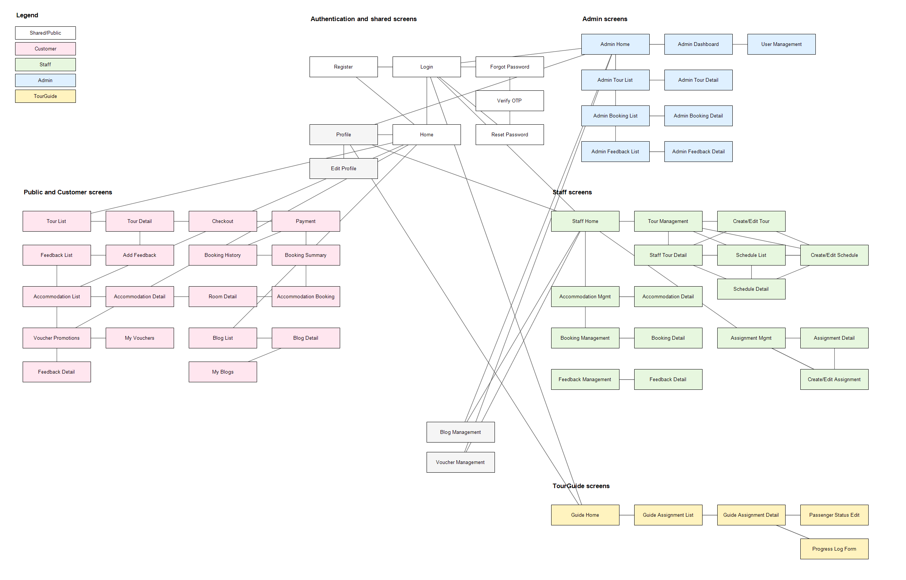

# Complete System Screen Flow

## Purpose

This diagram summarizes the user-visible screens and confirmed navigation implemented in the current Travel Service System repository.

## Role Legend

- Shared/Public: white or light gray
- Customer: light pink
- Staff: light green
- Admin: light blue
- TourGuide: light yellow

## Confirmed Roles

Confirmed from authentication filters and login routing: Public/Shared, Customer, Staff, Admin, TourGuide.

## Screen Flow Diagram

SVG version: [complete-system-screen-flow.svg](complete-system-screen-flow.svg)

Editable draw.io version: [complete-system-screen-flow.drawio](complete-system-screen-flow.drawio)

## Main Entry Points

- `/home` opens the public home page unless the signed-in user is Admin, Staff, or TourGuide, in which case the controller redirects to that role dashboard.
- `/login` is the authentication entry point and supports redirect-after-login for protected Customer pages.
- Public navigation from the header/footer reaches Tour, Accommodation, Voucher and Blog screens.
- Protected route prefixes are guarded by role filters: `/admin/*`, `/staff/*`, `/guide/*`, and selected Customer account/booking routes.

## Authentication Navigation

Login success routes Admin to `/admin/home`, Staff to `/staff/home`, TourGuide to `/guide/home`, and Customer/default users to the saved safe redirect or `/home`. Failed login forwards back to the login screen. Forgot password flows from Forgot Password to Verify OTP, then Reset Password, then back to Login.

## Role-Based Navigation

Admin screens are centered around Admin Home and the admin sidebar. Staff screens are centered around Staff Home and the staff sidebar. Customer screens are reached through the public header, account sidebar, and detail-page actions. TourGuide screens are reached from Guide Home and the guide sidebar.

## Tour Navigation

Customer Tour List opens Customer Tour Detail, which can start Checkout and booking. Staff Tour Management opens Create/Edit Tour, Staff Tour Detail and Schedule List. Creating a Tour redirects to Create Schedule. The first schedule save redirects back to Staff Tour Management, while later schedule saves return to Staff Tour Detail. Admin Tour List opens Admin Tour Detail, where approve/reject/status actions post back and redirect to the same detail screen.

## Important Redirects

- Unauthorized protected routes redirect to `/login` when no user is present.
- Authenticated users with wrong role receive `sendError(SC_FORBIDDEN)` from filters.
- Not-found detail routes generally redirect to the owning list screen.
- Payment cancel/failure returns to Booking History; successful payment can show Booking Summary.

## Notes

The overview keeps action-only endpoints as arrow labels instead of separate screen boxes. Legacy or unconfirmed WEB-INF staff prototype views are documented in `screen-flow-analysis.md` but not drawn as confirmed screens.
