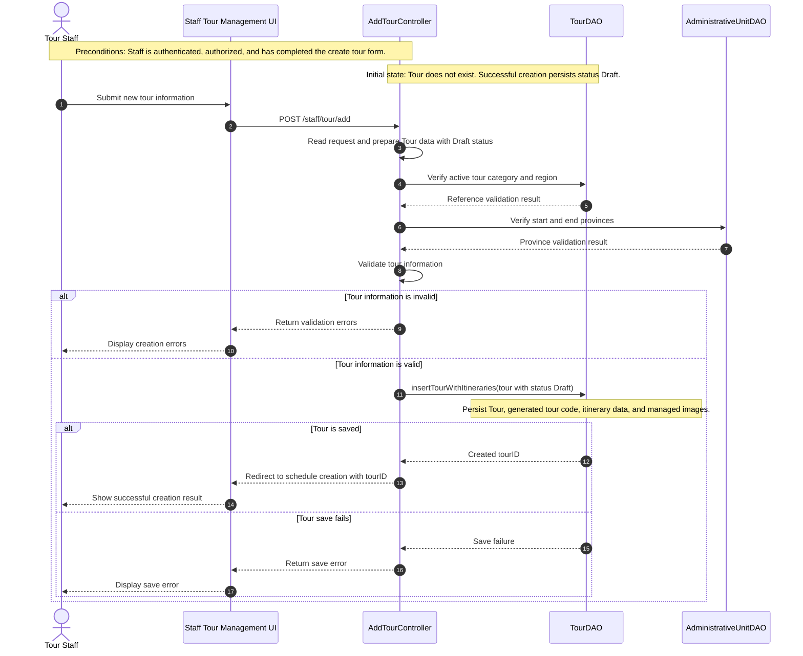
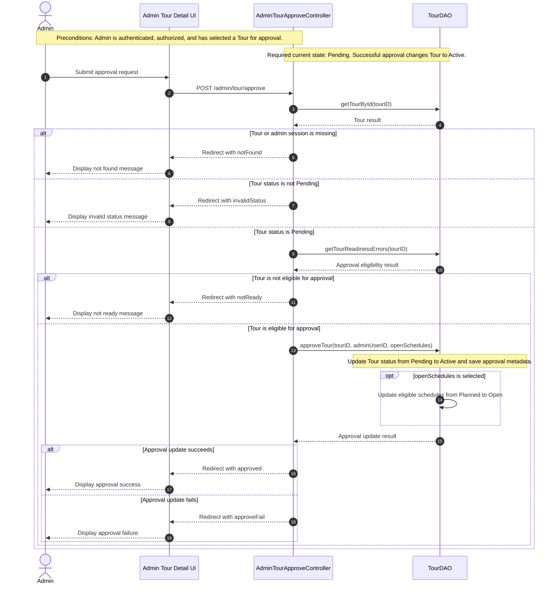

# Tour Sequence Diagram Analysis

## A. Modeling Scope

### Create Tour

- Scenario name: Create Tour.
- Actor: Tour Staff.
- Trigger: Staff submits the create tour form.
- Preconditions: Staff is authenticated, has Staff role, and the create tour form has already been completed.
- Start point: Staff submits new tour information.
- End point: The system either creates a Draft tour and returns the created tourID, or rejects the request because of validation/save failure.
- Success postcondition: A Tour record exists with status `Draft`; its tour code, itinerary data, and managed images are persisted.
- Failure postconditions: No valid new tour is available to continue with schedule creation; UI shows validation or save errors.
- Included participants: Tour Staff, Staff Tour Management UI, `AddTourController`, `TourDAO`, `AdministrativeUnitDAO`.
- Excluded interactions:
  - Login and staff authorization flow: treated as precondition.
  - Opening homepage/sidebar/menu/form: navigation and UI loading.
  - Loading every dropdown separately: not part of the submit scenario.
  - Field-by-field validation: aggregated into business validation.
  - SQL, transaction, generated key mechanics, image-loop details: implementation details.

### Approve Tour

- Scenario name: Approve Tour.
- Actor: Admin.
- Trigger: Admin submits an approval request for a selected tour.
- Preconditions: Admin is authenticated, authorized, and has already selected a tour from the admin tour detail screen.
- Start point: Admin submits the approval request.
- End point: The system either approves the tour, refuses approval because of business conditions, or reports update failure.
- Success postcondition: Tour status changes from `Pending` to `Active`; approval metadata is saved. If selected, eligible schedules change from `Planned` to `Open`.
- Failure postconditions: Tour status is unchanged; UI shows not found, invalid status, not ready, or approve failure result.
- Included participants: Admin, Admin Tour Detail UI, `AdminTourApproveController`, `TourDAO`.
- Excluded interactions:
  - Opening pending list, filtering, counting, and viewing tour detail: preconditions/use cases outside Approve Tour.
  - Reject Tour: source has a separate `AdminTourRejectController` and endpoint `/admin/tour/reject`.
  - Loading itinerary, schedule, and image detail for display: View Tour Detail concern.
  - SQL and transaction internals: DAO implementation details.

## B. Source Code Evidence

### Create Tour

- Endpoint: `POST /staff/tour/add`.
- Controller: `src/main/java/vn/edu/fpt/controller/staff/AddTourController.java`.
- Service: No separate service layer found for this use case.
- Business/control support: `StaffTourFormSupport` provides request reading, validation, and tour construction through inherited methods.
- DAO/Repository: `TourDAO`.
- Related data access: `AdministrativeUnitDAO` validates active provinces for start/end place.
- Entities/DTO-like structures: `Tour`, `TourItinerary`, `TourSchedule`, `TourFormData`.
- Status: `AddTourController` sets new tour status to `Draft` before validation/save.
- Business rules from source: active category/region, valid provinces, valid tour text/length, valid day/night rules, valid itinerary count/content, valid image path/upload result.
- Duplicate tour rule: no separate duplicate tour branch was confirmed in source; tour code is generated after insert.

### Approve Tour

- Endpoint: `POST /admin/tour/approve`.
- Controller: `src/main/java/vn/edu/fpt/controller/admin/AdminTourApproveController.java`.
- Service: No separate service layer found for this use case.
- DAO/Repository: `TourDAO`.
- Entities: `Tour`, `User`, `TourSchedule`.
- Required status before approval: `Pending`.
- Success status after approval: `Active`.
- Optional related state change: when `openSchedules` is selected, eligible `Tour_Scheduler` rows move from `Planned` to `Open`.
- Business rules from source: tour/admin session must exist, tour must be `Pending`, `getTourReadinessErrors(tourID)` must return no errors, approval update must succeed.
- Reject Tour scope: separate endpoint `/admin/tour/reject`, separate controller `AdminTourRejectController`; not included in Approve Tour diagram.

## C. Interaction Selection

| Interaction | Keep/Remove/Aggregate | Reason |
| --- | --- | --- |
| Staff submits tour information | Keep | Starts Create Tour scenario |
| UI sends `POST /staff/tour/add` | Keep | Crosses system boundary |
| Read request and prepare Tour data | Aggregate | Important control responsibility, field mapping omitted |
| Set status `Draft` | Keep | Create Tour state transition/postcondition |
| Verify category/region | Aggregate | Business reference validation through DAO |
| Verify start/end provinces | Aggregate | Business reference validation through `AdministrativeUnitDAO` |
| Validate each field separately | Aggregate | Field-level details are not UML collaboration |
| Save tour with itineraries/images | Keep | Main persistence operation |
| Generate tour code internals | Remove | DAO implementation detail |
| SQL/transaction/rollback detail | Remove | Persistence implementation detail |
| Admin submits approval request | Keep | Starts Approve Tour scenario |
| Find tour by ID | Keep | Required data for business decision |
| Check status `Pending` | Keep | Determines whether approval can continue |
| Check readiness errors | Keep | Approval eligibility rule |
| Update status `Pending` to `Active` | Keep | Main state transition |
| Optionally open schedules | Keep | Business effect selected by Admin |
| Reject Tour branch | Remove | Separate controller/use case in source |
| Load pending list/detail page | Remove | Preconditions/View use cases |

## D. Create Tour Sequence Diagram

## E. Approve Tour Sequence Diagram

## F. Diagram Review

### Create Tour

- Main scenario is complete from submit request to created Draft tour or failure result.
- Important exceptional flows are kept: invalid information and save failure.
- No algorithm, SQL, helper/private method, getter/setter, constructor, or field-by-field validation is shown.
- Navigation and authentication are not repeated; they are preconditions.
- No Service participant was added because source does not have a service layer for this use case.
- State transition is accurate: not existing -> `Draft`.
- Aggregated interactions: request parsing/mapping, business validation, reference validation, and related data persistence.

### Approve Tour

- Main scenario is complete from Admin approval request to `Active` tour or failure result.
- Important exceptional flows are kept: missing tour/admin session, invalid current status, not ready, update failure.
- Reject Tour is not included because source implements it as a separate endpoint/controller.
- No algorithm, SQL, detailed readiness rule list, or View Tour Detail loading is shown.
- Authentication/authorization are represented once as preconditions.
- No Service participant was added because source does not have a service layer for this use case.
- State transition is accurate: required `Pending`, success `Active`; optional schedules `Planned` -> `Open`.
- Mermaid syntax was checked by balancing `alt`, `else`, `opt`, and `end` blocks.
